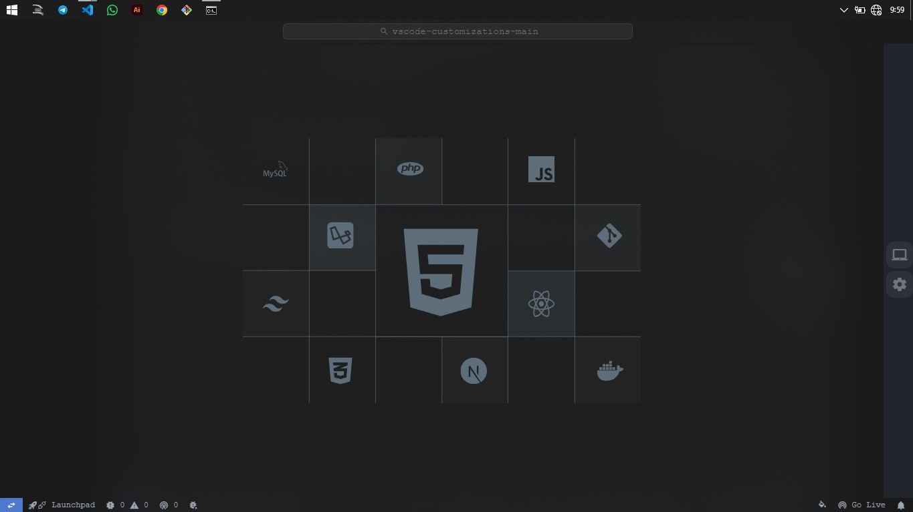
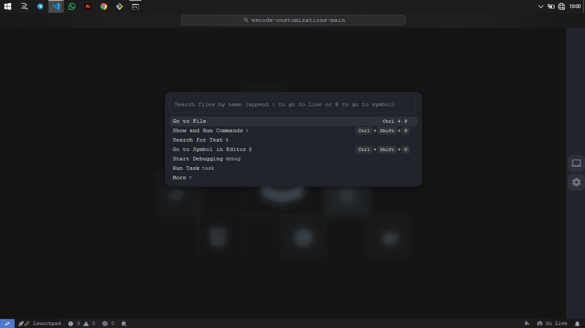

<!-- 
====================================================================
Author      : AlgorithmDev
Version     : 1.0
Code        : 100
Github      : https://github.com/mahisataruna
Telegram    : https://t.me/algorithmIDN
Changelog   : First Release [20241103]
==================================================================== 
-->
<p align="center">
  
  
</p>

<h1 align="center">VS Code Customization</h1>
<p align="center"><b>Version 1.0</b></p>

<div align="center">
    
    
    <h3>
        VS Code customization for your workbench.
    </h3>
</div>

### Used Extensions:

- [Github Theme](https://marketplace.visualstudio.com/items?itemName=GitHub.github-vscode-theme)
- [JetBrains Icon Theme](https://marketplace.visualstudio.com/items?itemName=chadalen.vscode-jetbrains-icon-theme)
- [Fluent Icons](https://marketplace.visualstudio.com/items?itemName=miguelsolorio.fluent-icons)
- [Custom CSS and JS Loader](https://marketplace.visualstudio.com/items?itemName=be5invis.vscode-custom-css)

---

### Instructions:

1. **Install the Extensions**
   - Install all the extensions listed above from the VS Code marketplace.

2. **Modify `settings.json`**
   - Add the configuration below to your VS Code `settings.json` file. **Make sure to back up your current settings** as this may overwrite them.

3. **Add the following configuration**:

    ```jsonc
    "vscode_custom_css.imports": [
        // Absolute file paths for your custom CSS/JS files
        // For Mac or Linux:
        // "file:///Users/[your-username]/[path-of-custom-css]/custome-code/custome-style.css",
        // "file:///Users/[your-username]/[path-of-custom-css]/custome-code/custome-script.js"

        // For Windows:
        // "file:///C:/[path-of-custom-css]/custome-code/custome-style.css",
        // "file:///C:/[path-of-custom-css]/custome-code/custome-script.js"
    ]
    ```

4. **Enable "Custom CSS and JS Loader"**
   - Open the command palette (`Ctrl+Shift+P` or `Cmd+Shift+P`) and type **"Enable Custom CSS and JS"** to activate the customizations.

5. **Customize Your CSS or JS**
   - Modify the CSS or JS files to change the appearance of Visual Studio Code to your liking. Explore different areas of VS Code that you want to customize.

6. **Reload the Extension**
   - After making any changes to your CSS or JS files, reload the extension from the command palette by selecting **"Reload Custom CSS and JS"**.

### Download

Download New Update! [Github](https://github.com/mahisataruna/myvscode-customize) & [Mediafire](https://sfl.gl/G2Qjxc0).

[](https://github.com/mahisataruna/myvscode-customize) [](https://sfl.gl/G2Qjxc0)   

<p align="center">
  <a href="https://t.me/algorithmdev"></a>
  <a href="https://t.me/algorithm_dev"></a>
  <br/>
  Algorithm © 2024
</p>
